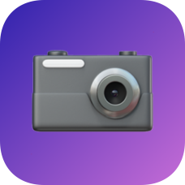

# CameraViewer

React Native App to display cameras from https://www.dpreview.com/products/cameras.

All data comes from https://github.com/dervondenbergen/cameraviewer-api.

## Starting

You can start the application the way it is explained in the official docs: https://facebook.github.io/react-native/docs/getting-started.html#testing-your-react-native-installation

## Files

[`index.ios.js`](index.ios.js) contains the navigation

[`views/*.js`](views) are the different possible views, which get loaded by the navigation

[`ios/cameraviewer/Images.xcassets`](ios/cameraviewer/Images.xcassets) contains the AppIcon + LaunchImage in different sizes

## Style

Most parts are stlyed with [`styled-components`💅](https://github.com/styled-components/styled-components#react-native), only in some places are normal Styles used

## Other Packages

Carousel if there is more then one image on product page:
https://github.com/appintheair/react-native-looped-carousel

Show original https://www.dpreview.com/ page for currently viewed product:
https://github.com/naoufal/react-native-safari-view

## Screenshots

[screenshots.md →](screenshots/screenshots.md)

## Tests

there are still no tests 🙈
