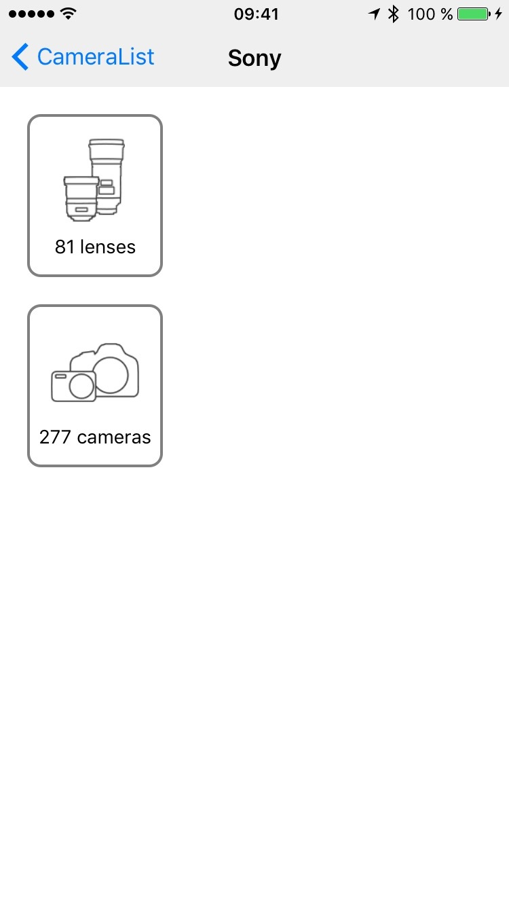
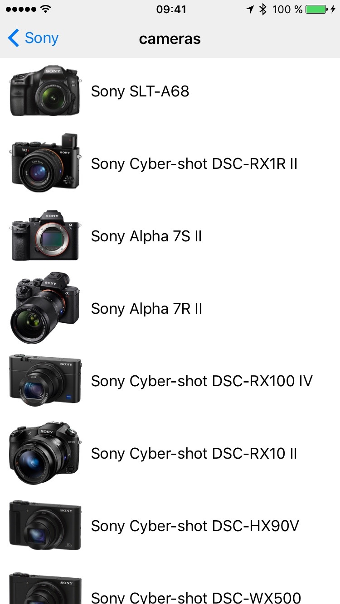
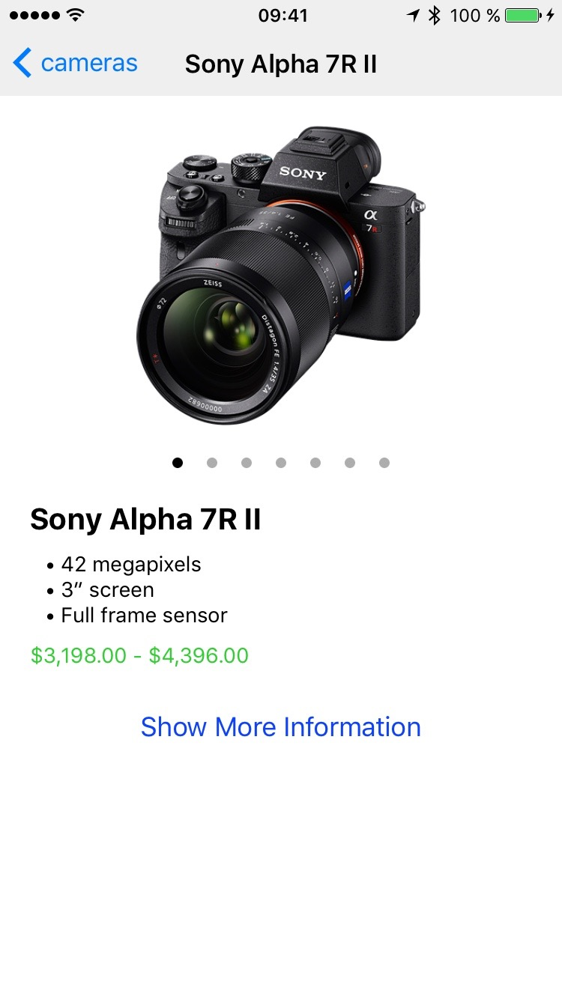

# Screenshots of different views

## [`AllBrands`](../views/AllBrands.js) view:

## [`Brand`](../views/Brand.js) view:

## [`AllProducts`](../views/AllProducts.js) view:

## [`Product`](../views/Product.js) view:

